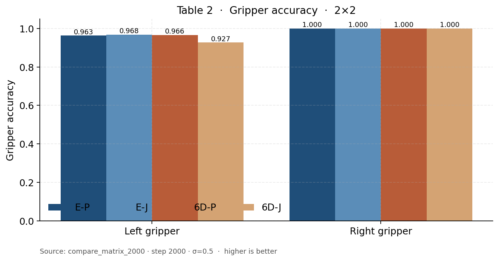
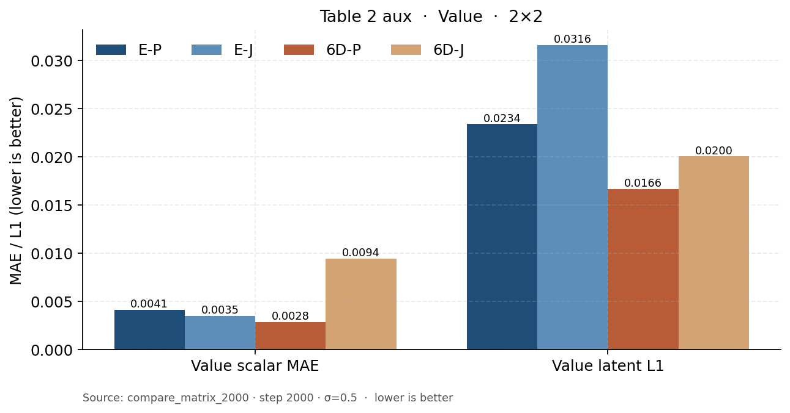
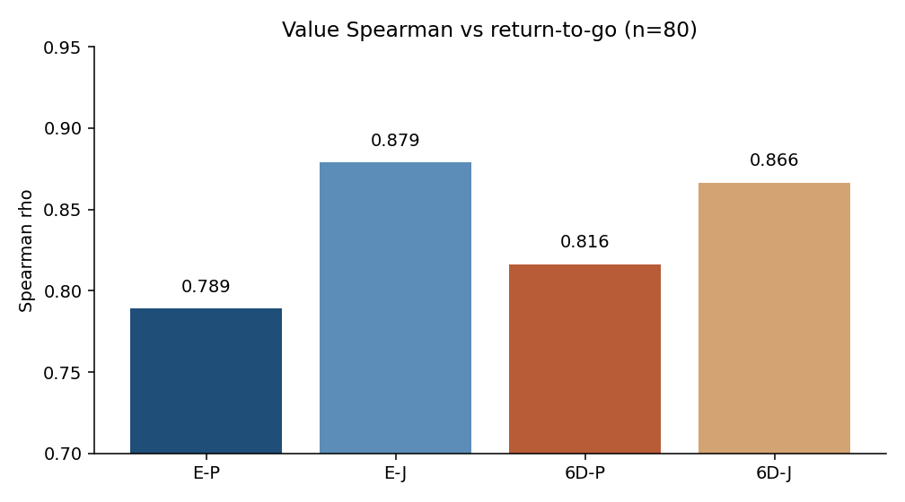
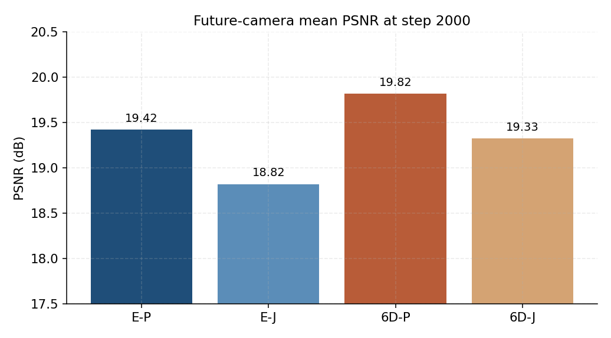
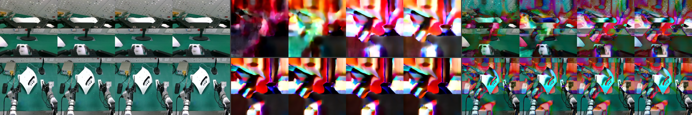
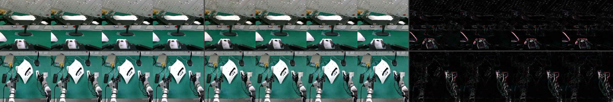
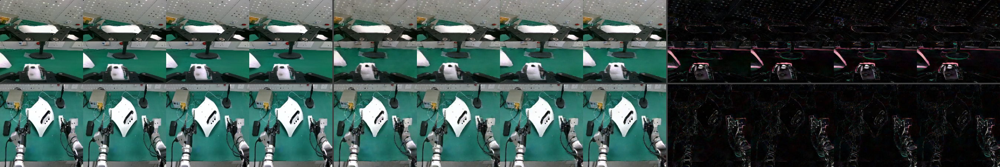
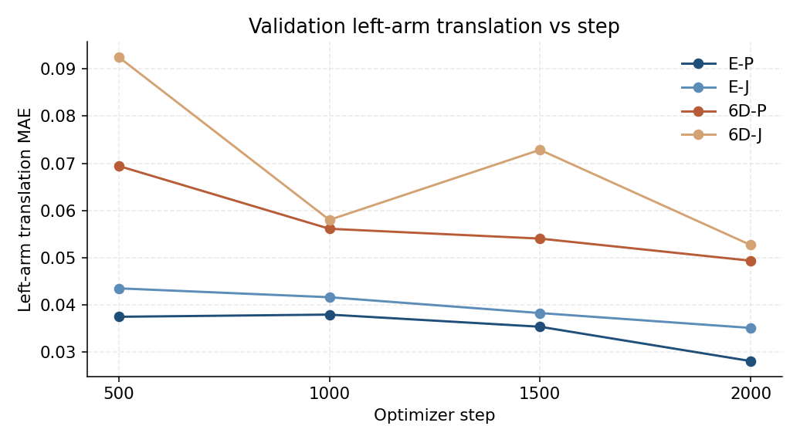
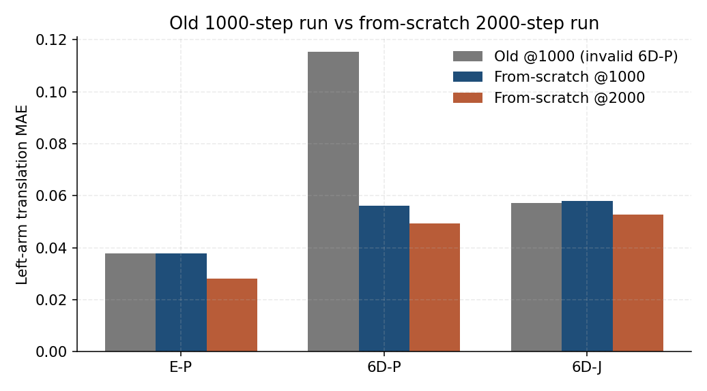

# 实验结果与分析（2000-step 从头，2×2）

后把手双臂安装。训练集只用成功演示。四个格子只改两件事：旋转怎么写进动作（Euler 14D vs rotation-6D 20D），以及每个 sample 抽哪种条件任务（`policy_only` vs `base_joint` 0.50/0.25/0.25）。

| Run | 表示 | 训练模式 | 输出目录 |
| --- | --- | --- | --- |
| E-P | Euler 14D | policy_only | `euler_14d_policy_2000` |
| E-J | Euler 14D | joint 50/25/25 | `euler_14d_joint_2000` |
| 6D-P | rotation-6D 20D | policy_only | `rotation6d_20d_policy_2000` |
| 6D-J | rotation-6D 20D | joint 50/25/25 | `rotation6d_20d_joint_2000` |

共同约束：同一批 221 成功 episode（train 177 / val 44）、同一 Predict2-2B 起步权重、同一 T5、seed 42、4 卡 DDP、有效 batch 128、从头训到 2000 step（约 0.93 epoch）。主表数字来自 step 2000、σ=0.5 的 full-suite validation。World RGB 是独立协议（冻结 8×2）。Value Spearman 是后来对同一批 ckpt 的 value-only 评测（n=80）。

底稿：`tables/`、`figures/compare/`。协议细节见 `CODE.md` 和实验 README。

**读表约定**

- 不要用 14D/20D raw MSE 做主结论。
- Euler 测地角接近 0°：增量 Euler × `rotation_scale=0.06`，不是旋转学完美。
- horizon-16：chunk 第 16 槽，不是闭环 16 步。
- 旧 6D-P@1000 左平移 0.115 / PSNR 17.38 作废（那次 run 末期训练异常）。
- 6D-J-ID-2000 停在 step 500，H3 不写结论。
- 单 seed。

## 1. 先说结论

**H1（Euler vs 6D）不能收成单一赢家。** 安装任务的难臂是左臂：policy-only 下 E-P 左平移 0.028，6D-P 0.049，相对差约 76%。右臂已经齐平（0.016 vs 0.015），夹爪两边都接近 1。像素反过来：未来相机 PSNR 是 6D-P 19.82、E-P 19.42。动作物理 MAE 不能当头条——6D-P 的 0.017 看起来优于 E-P 的 0.021，是旋转维和右臂把平均拉下来的。

**H2（Policy-only vs joint）在这个预算下不成立「表征更完整」。** 同一 encoding 里，joint 的左平移、World 主相机 L1、未来相机 PSNR 都没有超过 P。6D-J 左夹爪还掉到 0.927，Value MAE 最差（0.009）。唯一对 joint 有利的是 Value Spearman（E-J 0.879、6D-J 0.866，都高于同 encoding 的 P）：进度排序更好，尺度不一定更好。

**机制上的限定。** `policy_only` 已经预测 action + future + value。joint 只是把每个 sample 随机抽成 policy / world / value，大约一半更新才走 policy。0.93 epoch 里，少一半动作监督，本身就够解释「动作没赢」。不能把这次结果外推成「多目标条件永远没用」，只能写成「官方初始 50/25/25、不到 1 个 epoch、成功-only 时没赢」。

## 2. 协议：比的是什么

三个原问题：

1. 哪种旋转表示更好学？
2. 混合 World/Value 条件是否让表征更完整？
3. ID 是否真用未来反推动作？

第 3 个这次没有 2000-step 证据。第 1、2 个用同一张 2×2 拆开：先比第一列（E-P vs 6D-P），再比同一行里的 P vs J。

World 的正确协议是 **当前观测 + GT action → 未来画面**。这测的是「给了真动作，画面还准不准」，不是「自己猜动作再猜图」。后者会把策略误差和动力学误差缠在一起，这次没做。

Value 在成功数据上不是失败检测。轨迹里 return 仍随进度变化（靠前偏低、接近成功尾帧偏高）。MAE 看尺度，Spearman 看名次。AUROC 需要失败负类，主表不报。

## 3. H1：动作表示

| 指标 | E-P | 6D-P | 怎么读 |
| --- | --- | --- | --- |
| 左臂平移 MAE | **0.0281** | 0.0494 | 难臂，主证据 |
| 右臂平移 MAE | 0.0162 | **0.0154** | 已齐平 |
| 左夹爪 accuracy | 0.963 | 0.966 | 两边都接近饱和 |
| 右夹爪 accuracy | 1.000 | 1.000 | 无区分度 |
| 左 horizon-16 平移 | **0.0353** | 0.0547 | 和第 1 槽同方向，更难一点 |
| 右 horizon-16 平移 | **0.0161** | 0.0167 | 齐平 |

**分析。** 后把手安装里，左臂要对准孔位/把手，右臂更多是辅助。表示差异出现在难臂，而不是「6D 全面更差」。右臂和夹爪已经饱和，再比这两项分不出 encoding。

6D 把旋转写成两个 3D 列向量（6 个数），对 SO(3) 更连续，但回归目标从 3 维变成 6 维，同样 2000 step、同样有效 batch，左臂平移更难贴上去。这更像「同样预算下 6D 的难臂还没学满」，不像「6D 这个表示本身坏了」——因为像素上 6D-P 反而最好，右臂也已经齐平。

horizon-16 和整段均值同序：E-P 左 0.035 vs 6D-P 0.055。第 16 槽没有单独翻盘，说明优势不是只集中在第一步。

## 4. H2：训练目标

| 指标 | E-P | E-J | 6D-P | 6D-J |
| --- | --- | --- | --- | --- |
| 左臂平移 MAE | **0.0281** | 0.0351 | 0.0494 | 0.0527 |
| 右臂平移 MAE | 0.0162 | 0.0168 | **0.0154** | 0.0170 |
| 左夹爪 accuracy | 0.963 | **0.968** | 0.966 | 0.927 |
| 右夹爪 accuracy | 1.000 | 1.000 | 1.000 | 1.000 |
| 左 horizon-16 平移 | **0.0353** | 0.0456 | 0.0547 | 0.0573 |
| 6D 左臂旋转 (°) | 0.000 | 0.000 | 0.000 | 0.074 |

**分析。** 同一 encoding 里 joint 全面略差或明显差：E-J 左平移比 E-P 高 25%（0.035 vs 0.028）；6D-J 比 6D-P 略差（0.053 vs 0.049），左夹爪从 0.966 掉到 0.927。6D-J 还出现可分辨的左臂测地角 0.074°（horizon-16 0.090°），同预算的 6D-P 仍是 0。

最干净的解释是监督配比，不是「World 把表示带坏了」。joint 大约只有 50% 样本更新 policy。E-P / 6D-P 每个 sample 都按 policy 条件训（仍然预测 future/value）。0.93 epoch × 50% policy，等价于动作目标大概只看了半个 epoch。E-J 相对 E-P 的左臂差距（0.035 vs 0.028）和「少训了一截动作」相符。

1000-step 时曾经出现「6D-J 比 6D-P 好一倍」——那是在跟崩掉的 6D-P（左平移 0.115）比。健康的 6D-P@2000 是 0.049，joint 不再像在救人。

### 4.1 World / Value latent

| 指标 | E-P | E-J | 6D-P | 6D-J | 越好 |
| --- | --- | --- | --- | --- | --- |
| World 主相机 L1 | **0.0775** | 0.0873 | 0.0780 | 0.0790 | 低 |
| World 腕部 L1 | **0.1001** | 0.1122 | 0.1054 | 0.1010 | 低 |
| World 本体 L1 | 0.0453 | 0.0437 | **0.0329** | 0.0393 | 低 |
| Value 标量 MAE | 0.0041 | 0.0035 | **0.0028** | 0.0094 | 低 |
| Value Spearman | 0.789 | **0.879** | 0.816 | 0.866 | 高 |

**分析。** World 主相机 L1：E-P ≈ 6D-P（0.0775 vs 0.0780），E-J 明显最差（0.087）。joint 并没有因为多抽了 world 条件就把 latent 未来图像训得更好。一种读法是：25% world 抽样、不到 1 epoch，还不够换来更好的未来 latent；另一种是：policy 条件本身已经在训 future，再拆出 world 反而稀释了。现有 2×2 无法拆开这两种，只能报告「这个配方下 latent world 没有赢」。

Value 出现尺度和排序的分裂。6D-P 的 MAE 最好（0.0028），6D-J 最差（0.0094），但 Spearman 是 6D-J 0.866 > 6D-P 0.816。E-J 的 MAE 略好于 E-P，Spearman 也最好（0.879）。含义是：joint 更常把「快完成」排在「刚开始」前面，但 6D-J 的绝对数值可以整体偏一截。Spearman n=80，只能当方向，不能当精确到小数点后两位的排名竞赛。

同一次 value-only 评测里的 MAE（n=80，和 Spearman 同分布）仍是 6D-J 最差（0.010），和 end-eval 同序，所以「MAE 差、排序好」不是两套样本对不上。

## 5. World RGB

协议：当前观测 + GT action → 未来腕/主相机。冻结 8 episode × 2 行，seed `20260820`，10 步，guidance 1.0。base 是未微调的 Predict2，约 7.4 dB，两边 encoding 地板几乎一样，说明没训时旋转写法不改变像素下限。

| | Euler-base | 6D-base | E-P | E-J | 6D-P | 6D-J |
| --- | --- | --- | --- | --- | --- | --- |
| 未来相机 PSNR | 7.40 | 7.38 | 19.42 | 18.82 | **19.82** | 19.33 |
| 主相机 PSNR | 6.93 | 6.86 | 20.62 | 20.07 | **21.37** | 20.80 |
| 腕部 PSNR | 7.88 | 7.91 | 18.22 | 17.57 | 18.27 | 17.86 |
| 未来相机 SSIM | 0.198 | 0.196 | 0.726 | 0.680 | **0.735** | 0.717 |

**分析。** 像素排序是 6D-P > E-P > 6D-J > E-J。和动作左臂的排序（E-P > E-J > 6D-P > 6D-J）不一致。和 latent 主相机 L1（E-P 略好于 6D-P）也不一致。所以：

- 不能用 latent L1 代替 PSNR。L1 在压缩后的未来相机槽上算，PSNR 在 restore + decode 之后的 RGB 上算，中间还有 VAE。
- 不能用「谁动作好谁画面好」一笔带过。6D 在给了 GT 动作之后，把未来相机画得更像；Euler 在自己回归左臂位移时更准。一个偏动力学回放，一个偏策略回归。
- 1000-step 的「6D-J 像素 19.72 最高」不能外推。那个 6D-P 像素 17.38 对应异常 run；这次健康的 6D-P 是 19.82。

同一帧定性例子（`0804_095314` row 750：上行腕、下行主相机；左 GT、中 Pred、右误差）。base 发糊，四个微调模型都已经能对上台面和手臂轮廓。细差别要看 PSNR 均值，单帧不能当排名。全部拼图在 `figures/rgb_examples/`。

| 模型 | 拼图 |
| --- | --- |
| Euler-base |  |
| E-P |  |
| 6D-P |  |

## 6. 训练过程：还没饱和

验证左平移（每 500 step）：

| step | E-P | E-J | 6D-P | 6D-J |
| --- | --- | --- | --- | --- |
| 500 | 0.0375 | 0.0435 | 0.0694 | 0.0925 |
| 1000 | 0.0379 | 0.0416 | 0.0561 | 0.0580 |
| 1500 | 0.0354 | 0.0383 | 0.0540 | 0.0728 |
| 2000 | **0.0281** | 0.0351 | 0.0494 | 0.0527 |

**分析。** E-P 在 1500→2000 还有一截（0.035→0.028）。6D-P 从 0.069 单调降到 0.049，没有翻盘 E-P。6D-J 在 1500 回弹到 0.073，2000 又回到 0.053，波动比 6D-P 大，和「只有一半样本走 policy」一致。四条都还在降，这次预算没有把 H1 的左臂差距训平，也没有给 joint 足够的动作更新去追 P。

四条的 train EDM 都在约 200 step 内掉到 0.06 以下，之后在 0.02–0.06 抖动，没有再出现旧 6D-P 那种末期卡在 0.09–0.11 的崩法。

| | 旧@1000 左平移 | 新@1000 | 新@2000 |
| --- | --- | --- | --- |
| E-P | 0.0377 | 0.0379 | 0.0281 |
| 6D-P | **0.1153（作废）** | 0.0561 | 0.0494 |
| 6D-J | 0.0571 | 0.0580 | 0.0527 |

教训：对比实验要看训练是否健康，不能只看终表。旧 6D-P 把「joint 救了 6D」做成假故事；新 2×2 里 joint 不再救人。

## 7. H3：ID

`rotation6d_20d_joint_id_2000` 停在 step 500。主表不拼 1000-step 的 Δ_future。1000-step 附录里 `action_physical_mae` 的 Δ 约为 +0.0076，右臂旋转 Δ 为负——即便以后要引用，也不能写成「所有自由度都用了未来」。

## 8. 限定

- 单 seed 42，没有误差条。
- 约 0.93 epoch，曲线还在降。
- 成功-only：Value 不是失败检测；World 没在失败分布上评。
- 离线、开环：没有闭环成功率，没有真机。
- World RGB 16 帧；Spearman n=80。
- 2000-step 训练没用上后来的 row-group 读取优化（那是评测之后才合进树的）。

WandB 项目：`cosmos-offline-compare-2000`。完整 jsonl 在 `train_outputs/action_representation_20260903/*_2000/`。权重约 19G/ckpt，不在本目录。

## 9. 展望

### 9.1 优化目标（工程，不破可比性）

优先做不改 mask / 采样概率 / action 布局的事：

1. **Resume 做成 O(1)。** 现在 skip epoch-0 和重训一样慢。保存 sampler 游标，或按 `samples_seen` 建 skip 索引。对比实验在修好之前继续规定只从头训。
2. **评测权重另存 `model_only`。** 19G 里大部分是 optimizer，分享和 visualize 不需要。
3. **YAML 路径环境变量化。** 现在写死 `/media/jushen/...`，换机器才能复现。
4. **Spearman / World RGB 加样本。** Spearman 拉到和 end-eval 同量级（约 320）；RGB 出逐帧表，确认均值不是一两帧抬起来的。
5. **下一次训练自动吃到 row-group 读取。** 已在树里。若再改采样顺序（先打乱 episode），IO 还会再好一截，但那会改变训练顺序，必须新开预算，不能和本表横比。

### 9.2 实验方向（科学）

按三个原问题往下推，一次只动一个混淆因素。

**把 H1 写死（表示）。** 在不能加长这次 run 的前提下：闭环或真机上看「难臂动作准」和「未来画面像」哪个更影响装上把手。离线赢家不唯一——动作用 E-P，画面用 6D-P——真机是唯一能打破平局的地方。若以后还能再训：同一 2×2 加到约 2 epoch，看左臂 0.028 vs 0.049 是否收拢；仍不要改 50/25/25。

**把 H2 写死（目标）。** 现在「joint 没赢」和「policy 更新少了一半」缠在一起。下一次要么（a）加长到 joint 的累计 policy 样本和现在的 P 相当，要么（b）做一组控制：同样 50% 样本率，但抽到的仍是 policy 条件（没有 world/value 混合）。（b）才能说清是稀释还是混合本身有害。官方第二阶段 10/45/45 + on-policy rollout 是另一条线：那是 planning，会碰到失败数据，不要并进这张成功-only 主表。

**补 H3（ID）。** 把 `6D-J-ID` 从头训到和 2×2 同一预算，只在新 ckpt 上算 Δ_future（shuffle − normal）。不要和 1000-step ID 拼接。右臂旋转若再出现负 Δ，分开报，不要写「ID 全面有效」。

**Value 的下一问。** 已有「排序好、6D-J 尺度差」。下一步在冻结 ckpt 上用 0804 失败做附录：零样本看低 return 是否排在后面。主表仍只用成功。不要为了 AUROC 把失败并进所有训练。

**不要做的。** 再训一条同样的 2000-step joint；把失败混进主表再声称「只在成功演示上表征更完整」；改 mask 来「加快」；用旧 6D-P@1000 当 6D 基线；把 Spearman 写成 joint 赢了 H2。
