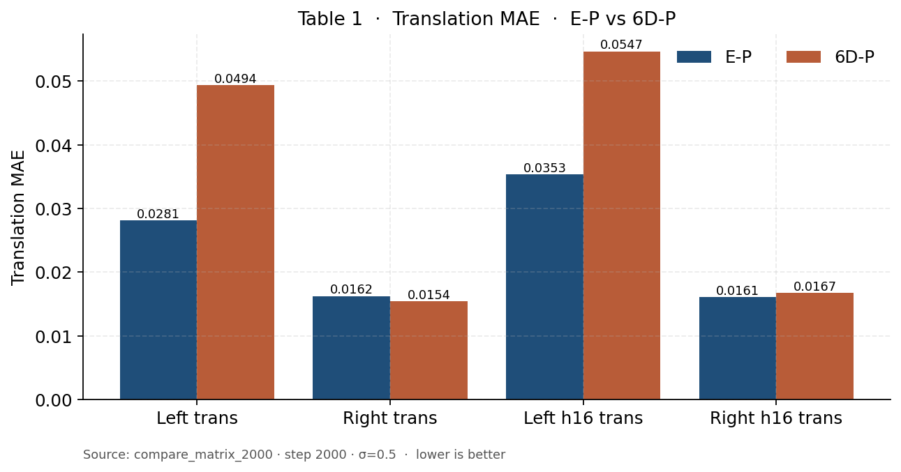
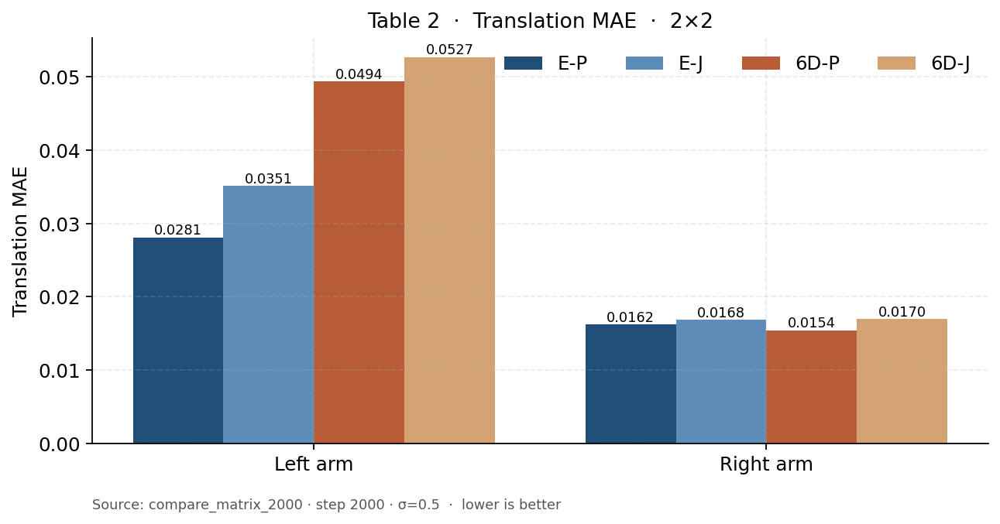
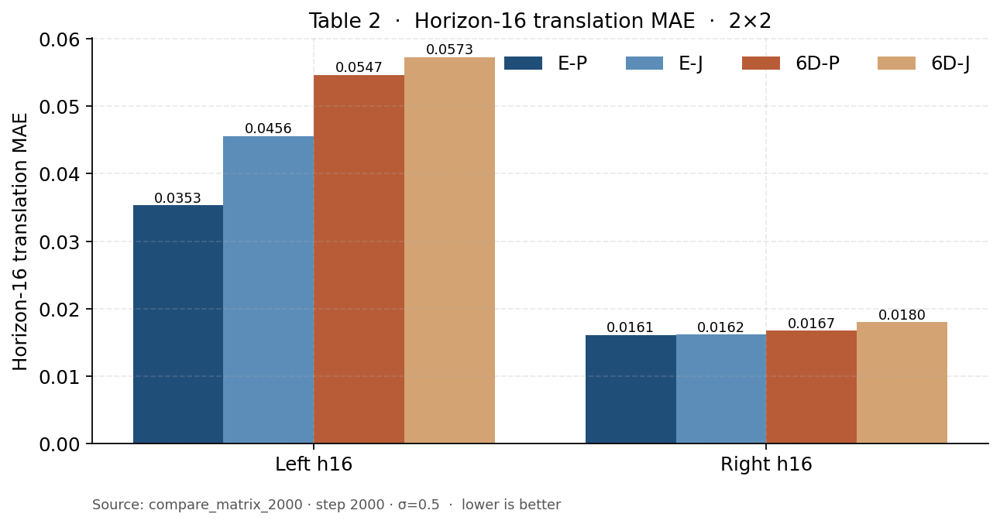
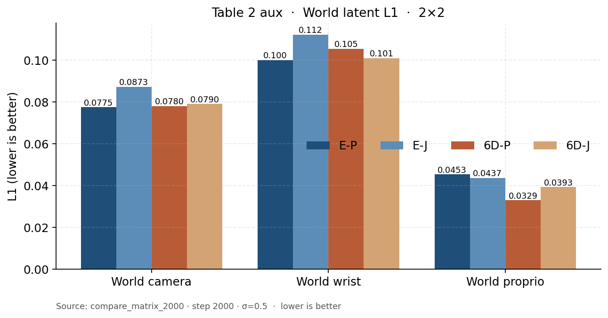
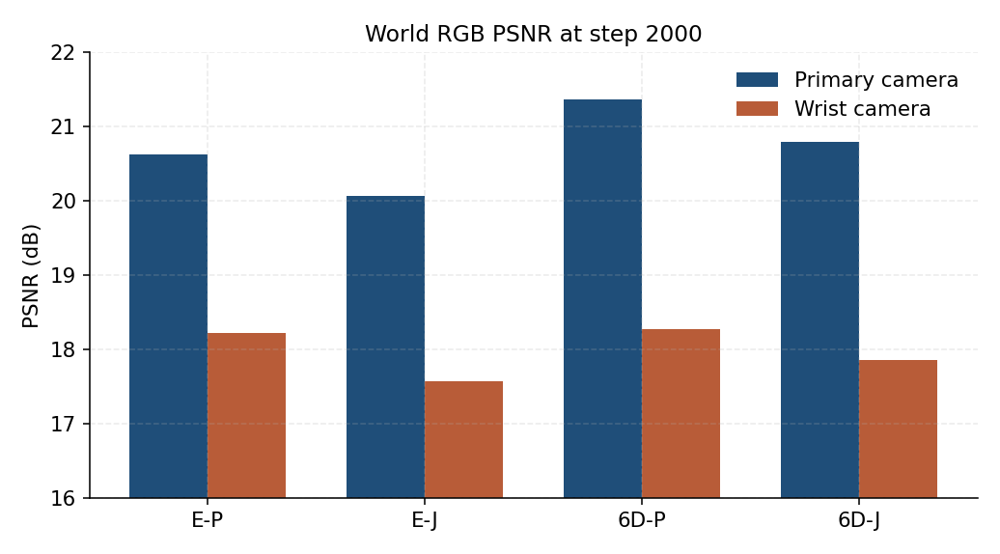

# action_representation_20260903 主表（2000-step 从头）

来源：各 `*_2000` run 的 `metrics.jsonl` 最后一次 full-suite validation（step 2000, σ=0.5）。四条都是 seed 42、有效 batch 128、从 Predict2 权重从头训到 2000（约 0.93 epoch），不是 resume。不要用 14D/20D raw MSE 做主结论。horizon-16 是 chunk 第 16 槽，不是闭环 16 步。旧 6D-P@1000 左平移 0.115 是那次 run 末期训练异常，本表不用它。

### 表 1：E-P vs 6D-P（动作表示）

| 指标 | E-P | 6D-P |
| --- | --- | --- |
| 左臂旋转 (°) | 0.0000 | 0.0000 |
| 右臂旋转 (°) | 0.0000 | 0.0000 |
| 左臂平移 MAE | 0.0281 | 0.0494 |
| 右臂平移 MAE | 0.0162 | 0.0154 |
| 左夹爪 accuracy | 0.963 | 0.966 |
| 右夹爪 accuracy | 1.000 | 1.000 |
| 左臂 horizon-16 旋转 (°) | 0.0000 | 0.0000 |
| 右臂 horizon-16 旋转 (°) | 0.0000 | 0.0000 |
| 左臂 horizon-16 平移 | 0.0353 | 0.0547 |
| 右臂 horizon-16 平移 | 0.0161 | 0.0167 |

E-P 旋转测地线接近 0°，因为增量 Euler × `rotation_scale=0.06` 本身很小；不要据此说 Euler 旋转已经学完美。表 1 主看平移 MAE 和夹爪 accuracy。左臂仍是 E-P 更好（0.028 vs 0.049）；右臂已经齐平（0.016 vs 0.015）。夹爪两边都接近 1。

### 表 2：E-P / E-J / 6D-P / 6D-J（2×2 训练目标）

| 指标 | E-P | E-J | 6D-P | 6D-J |
| --- | --- | --- | --- | --- |
| 左臂旋转 (°) | 0.0000 | 0.0000 | 0.0000 | 0.0740 |
| 右臂旋转 (°) | 0.0000 | 0.0000 | 0.0000 | 0.0000 |
| 左臂平移 MAE | 0.0281 | 0.0351 | 0.0494 | 0.0527 |
| 右臂平移 MAE | 0.0162 | 0.0168 | 0.0154 | 0.0170 |
| 左夹爪 accuracy | 0.963 | 0.968 | 0.966 | 0.927 |
| 右夹爪 accuracy | 1.000 | 1.000 | 1.000 | 1.000 |
| 左臂 horizon-16 旋转 (°) | 0.0000 | 0.0000 | 0.0000 | 0.0903 |
| 右臂 horizon-16 旋转 (°) | 0.0000 | 0.0000 | 0.0000 | 0.0000 |
| 左臂 horizon-16 平移 | 0.0353 | 0.0456 | 0.0547 | 0.0573 |
| 右臂 horizon-16 平移 | 0.0161 | 0.0162 | 0.0167 | 0.0180 |

### 表 2 补充：World / Value latent

| 指标 | E-P | E-J | 6D-P | 6D-J |
| --- | --- | --- | --- | --- |
| World 主相机 L1 | 0.0775 | 0.0873 | 0.0780 | 0.0790 |
| World 腕部 L1 | 0.1001 | 0.1122 | 0.1054 | 0.1010 |
| World 本体 L1 | 0.0453 | 0.0437 | 0.0329 | 0.0393 |
| World value L1 | 0.0217 | 0.0300 | 0.0159 | 0.0174 |
| Value 标量 MAE | 0.0041 | 0.0035 | 0.0028 | 0.0094 |
| Value latent L1 | 0.0234 | 0.0316 | 0.0166 | 0.0200 |
| Value Spearman | 0.789 | **0.879** | 0.816 | 0.866 |

同一 encoding 下 joint 在动作、World latent、像素上都没有赢：E-J 左平移和 World 主相机都差于 E-P；6D-J 左平移略差于 6D-P，左夹爪掉到 0.927，Value 标量 MAE 最差。

Value Spearman 是例外：预测 value 槽均值 vs GT `value_function_return`，n=80（1 GPU、YAML `max_validation_batches=40`），越高越好。量的是成功轨迹上的进度排序，不是失败检测。E-J 0.879 / 6D-J 0.866 都高于同 encoding 的 P。6D-J 的 MAE 仍然最差，说明尺度偏了但名次还在。不要据此写成「joint 表征更完整」。

### 表 3：6D-J-ID 的 Δ_future（shuffle − normal）

2000-step 的 6D-J-ID 尚未训完（`rotation6d_20d_joint_id_2000` 仍停在 step 500）。本表不拼 1000-step 的旧 Δ_future。

### 表 4：World RGB（当前观测 + GT action → 未来相机）

冻结 8 episode × 2 行，noise seed `20260820`，10 步采样，guidance 1.0。目录是 `visualize/*_2000/`，没有覆盖 1000-step 的图。base 是未训练 Predict2，沿用已有 `visualize/*_base/`。PSNR/SSIM 越高越好。不要和 `compare_matrix/` 的 1000-step 像素表混用；旧 6D-P@1000 的 PSNR 17.38 对应那次异常 run，本表不用。

| 指标 | Euler-base | 6D-base | E-P | E-J | 6D-P | 6D-J |
| --- | --- | --- | --- | --- | --- | --- |
| 未来相机 PSNR | 7.40 | 7.38 | 19.42 | 18.82 | 19.82 | 19.33 |
| 主相机 PSNR | 6.93 | 6.86 | 20.62 | 20.07 | 21.37 | 20.80 |
| 腕部 PSNR | 7.88 | 7.91 | 18.22 | 17.57 | 18.27 | 17.86 |
| 未来相机 SSIM | 0.198 | 0.196 | 0.726 | 0.680 | 0.735 | 0.717 |
| 主相机 SSIM | 0.177 | 0.167 | 0.799 | 0.769 | 0.818 | 0.799 |
| 腕部 SSIM | 0.220 | 0.225 | 0.653 | 0.591 | 0.652 | 0.635 |

像素排序：**6D-P (19.82) > E-P (19.42) > 6D-J (19.33) > E-J (18.82)**。同一 encoding 下 joint 仍然没有赢：E-J 差于 E-P，6D-J 差于 6D-P。这和表 2 的动作 / latent 结论一致，所以 1000 步时「joint 像素最好」不能外推到这次 2000-step 2×2。

latent L1 和 PSNR 不完全同序。表 2 补充里 World 主相机 L1 是 E-P 0.0775 ≈ 6D-P 0.0780（E-P 略好）；像素上 6D-P 反超 E-P。不要用 latent L1 代替 PSNR。动作上左臂仍是 E-P 更好（0.028 vs 0.049），像素上是 6D-P 更好——H1 不要收成单一赢家。
